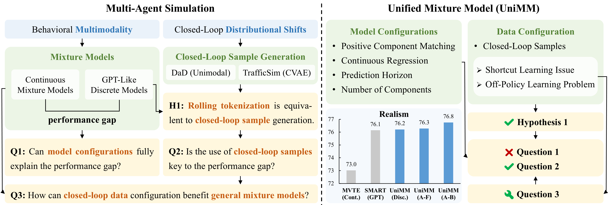

<a id="readme-top"></a>

<div align="center">
  <h1 class="title is-1 publication-title">
    Revisit Mixture Models for Multi-Agent Simulation: Experimental Study within a Unified Framework
  </h1>

  <p>
    <a href="https://longzhong-lin.github.io/unimm-webpage">
      
    </a>
    <a href="https://arxiv.org/pdf/2501.17015">
      
    </a>
  </p>
  
  <div class="is-size-5 publication-authors">
    <span class="author-block">
    <a href="https://scholar.google.com/citations?user=1rz42gIAAAAJ&hl=en" target="_blank">Longzhong Lin</a><sup>1,2</sup>,</span>
    <span class="author-block">
    <a href="https://scholar.google.com/citations?user=pfXQwcQAAAAJ&hl=en" target="_blank">Xuewu Lin</a><sup>2</sup>,</span>
    <span class="author-block">
    <a href="https://xukechun.github.io" target="_blank">Kechun Xu</a><sup>1</sup>,</span>
    <span class="author-block">
    <a href="https://scholar.google.com.hk/citations?user=dNAbVgIAAAAJ&hl=zh-CN" target="_blank">Haojian Lu</a><sup>1</sup>,</span>
    <span class="author-block">
    <a href="https://scholar.google.com/citations?user=F2e_jZMAAAAJ&hl=en" target="_blank">Lichao Huang</a><sup>2</sup>,</span>
    <span class="author-block">
    <a href="https://scholar.google.com/citations?user=1hI9bqUAAAAJ&hl=en" target="_blank">Rong Xiong</a><sup>1</sup>,</span>
    <span class="author-block">
    <a href="https://ywang-zju.github.io" target="_blank">Yue Wang</a><sup>1</sup>
    </span>
  </div>

  <div class="is-size-5 publication-authors">
    <span class="author-block"><sup>1</sup>Zhejiang University, <sup>2</sup>Horizon Robotics</span>
  </div>

  
  
</div>


## Abstract
Simulation plays a crucial role in assessing autonomous driving systems, where the generation of realistic multi-agent behaviors is a key aspect.
In multi-agent simulation, the primary challenges include behavioral multimodality and closed-loop distributional shifts.
In this study, we revisit mixture models for generating multimodal agent behaviors, which can cover the mainstream methods including continuous mixture models and GPT-like discrete models.
Furthermore, we introduce a closed-loop sample generation approach tailored for mixture models to mitigate distributional shifts.
Within the unified mixture model~(UniMM) framework, we recognize critical configurations from both model and data perspectives.
We conduct a systematic examination of various model configurations, including positive component matching, continuous regression, prediction horizon, and the number of components.
Moreover, our investigation into the data configuration highlights the pivotal role of closed-loop samples in achieving realistic simulations.
To extend the benefits of closed-loop samples across a broader range of mixture models, we further address the shortcut learning and off-policy learning issues.
Leveraging insights from our exploration, the distinct variants proposed within the UniMM framework, including discrete, anchor-free, and anchor-based models, all achieve state-of-the-art performance on the WOSAC benchmark.


## News

[TBA] Code release is coming soon. Stay tuned!

[2025-01] The paper has been released on [arXiv](https://arxiv.org/pdf/2501.17015).  


## Citation
If you find this work useful in your research, please consider citing us:
```
@misc{lin2025revisitmixturemodelsmultiagent,
      title={Revisit Mixture Models for Multi-Agent Simulation: Experimental Study within a Unified Framework}, 
      author={Longzhong Lin and Xuewu Lin and Kechun Xu and Haojian Lu and Lichao Huang and Rong Xiong and Yue Wang},
      year={2025},
      eprint={2501.17015},
      archivePrefix={arXiv},
      primaryClass={cs.AI},
      url={https://arxiv.org/abs/2501.17015}, 
}
```